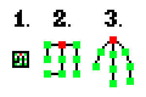
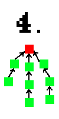
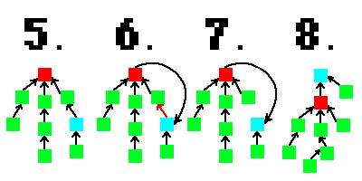
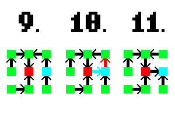

# Moving Maze Algorithm "[Origin Shift](https://www.youtube.com/watch?v=zbXKcDVV4G0&t=151s)" Explained:

## First, a short explanation about non-moving maze generation:

The algorithm used to generate a basic maze is [Wilson's Algorithm](https://en.wikipedia.org/wiki/Maze_generation_algorithm). This algorithm starts with a grid of nodes/tiles. Initially, all tiles are not a part of the maze.

Wilson's algorithm follows these steps:

1. A random tile "O" is chosen to be part of the maze.

2. Another random tile "T" is chosen to be the start of a "walk".

3. From tile "T", a path is randomly generated. If this path loops in on itself, all tiles in the loop are removed from the path.

4. The "walk" ends when a tile that is already in the maze is encountered during the walk.

5. Steps 2-4 are repeated until all tiles are a part of the maze.

Wilson's algorithm always generates a perfect maze, or a maze with no loops and unreachable areas.

## Visualizing mazes as trees:

Mazes can be visualized as trees, or acyclic graphs.

**Figure 1:**

As shown above in figure 1:

1. You see a simple maze consisting of 9 nodes in a 3x3 pattern. The nodes are colored in with green or red. If there is a path between nodes, there is no maze wall. 

2. The red node is the "root" of the tree, and this was decided arbitrarily. As you can see from the image above, if you replace open paths between nodes in a maze with edges, you'll end up with a tree.

3. The tree representation of the maze is unfolded, and here you can see a more typical drawing of a tree.

The current tree visualization is undirected, meaning that the edges of the tree only go one way. We can also visualize the trees derived from these mazes as directed, as shown below:

**Figure 2:**

As shown above in figure 2:

This is the same maze in figure 1, just modified to be a directed tree instead of an undirected one. This is just another way of visualizing the maze, and it will be needed for the origin shift algorithm.

In figure 2, the root is the red node, and all of its children point to it.

## Changing the root of a tree:

I don't really see a lot about this online, so here's an explanation about how you can change the root of a directed tree and still retain the directed tree property. A full rerooting can be seen below in figure 3:

**Figure 3:**

The blue node is the new root, while the red node is the old root. As you can see, the full process is as follows:

1. Set old root's parent to be the new root.
2. Remove new root's parent, as roots don't have parents.
3. Now you have a new root for your tree!

You can see above that the new tree is still acyclic. In addition, every node is still in the tree. These properties are essential for perfect mazes.

## Origin Shift:

I would recommend watching [CaptainLuma's video](https://www.youtube.com/watch?v=zbXKcDVV4G0&t=151s) on this as there are great visuals. If you really want to understand this algorithm, you should also trace it out by hand.

We've already established that you can view a maze as a weirdly folded tree. The open passageways in the maze correspond to edges in the tree. We've also established that it is possible to re-root a tree and still end up with a tree which satisfies all the requirements of a perfect maze.

Origin shift is essentially just a tree re-rooting. Here is a visual example:

**Figure 4:**

The maze is once again visualized as a weirdly folded tree. You can see under (9.), (10.), and (11.) that the switching the root from the old root (red square) to the new root (blue square) results a change in the maze layout.

**Figure 5:**

It is also possible for the maze layout to not change at all after a shift. As shown in figure 5, shifting does not change the maze layout, but it does change the internal tree representation of the maze.

One thing to remember is that the root can only be shifted to nodes directly adjacent to the current root in the maze representation of the tree. This is because paths in a maze can only reach adjacent tiles; you can't jump over tiles in a maze.
