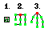

# Moving Maze Algorithm "[Origin Shift](https://www.youtube.com/watch?v=zbXKcDVV4G0&t=151s)" Explained:

### First, a short explanation about non-moving maze generation:

The algorithm used to generate a basic maze is [Wilson's Algorithm](https://en.wikipedia.org/wiki/Maze_generation_algorithm). This algorithm starts with a grid of nodes/tiles. Initially, all tiles are not a part of the maze.

Wilson's algorithm follows these steps:

1. A random tile "O" is chosen to be part of the maze.

2. Another random tile "T" is chosen to be the start of a "walk".

3. From tile "T", a path is randomly generated. If this path loops in on itself, all tiles in the loop are removed from the path.

4. The "walk" ends when a tile that is already in the maze is encountered during the walk.

5. Steps 2-4 are repeated until all tiles are a part of the maze.

Wilson's algorithm always generates a perfect maze, or a maze with no loops and unreachable areas.

### Visualizing mazes as trees:

Mazes can be visualized as trees, or undirected acyclic graphs.

